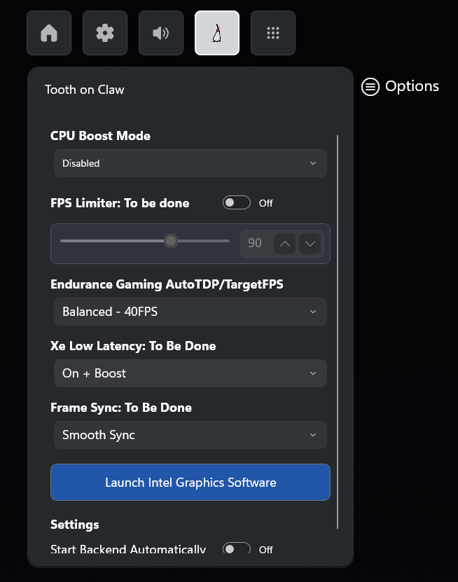

# Tooth on Claw

Claw 8 AI+ extra Settings Widget.

Designed to be lightweight and complement MSI Quick Settings options.
This is not intended to replace MSI Quick Settings.

## Supported Devices
- MSI Claw 8 AI+ A2VM with Intel Lunar Lake.

### Bugs & Features
Found a bug and want it fixed? Have an idea for a new feature?
Please [open an issue](https://github.com/BassemMohsen/ToothNClaw/issues) in the tracker.  

## Credits & Libraries
- [Valkirie/HandheldCompanion](https://github.com/Valkirie/HandheldCompanion)
- [chenx-dust/RyzenAdjUWP](https://github.com/chenx-dust/RyzenAdjUWP)

## ☕ Support Me
If you like my work, consider buying me a coffee:  

